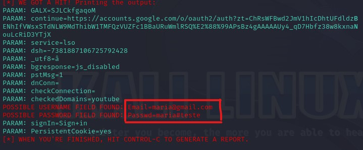

# Phishing para captura de senhas do Facebook

### Ferramentas

- Kali Linux
- setoolkit

### Configurando o Phishing no Kali Linux

- Acesso root: ``` sudo su ```
```
┌──(kali㉿kali)-[~]
└─$ sudo su
[sudo] senha para kali:
``` 
- Iniciando o setoolkit: ``` setoolkit ```
```
                     ..:::::::::..
                  ..:::aad8888888baa:::..
              .::::d:?88888888888?::8b::::.
            .:::d8888:?88888888??a888888b:::.
          .:::d8888888a8888888aa8888888888b:::.
         ::::dP::::::::88888888888::::::::Yb::::
        ::::dP:::::::::Y888888888P:::::::::Yb::::
       ::::d8:::::::::::Y8888888P:::::::::::8b::::
      .::::88::::::::::::Y88888P::::::::::::88::::.
      :::::Y8baaaaaaaaaa88P:T:Y88aaaaaaaaaad8P:::::
      :::::::Y88888888888P::|::Y88888888888P:::::::
      ::::::::::::::::888:::|:::888::::::::::::::::
      `:::::::::::::::8888888888888b::::::::::::::'
       :::::::::::::::88888888888888::::::::::::::
        :::::::::::::d88888888888888:::::::::::::
         ::::::::::::88::88::88:::88::::::::::::
          `::::::::::88::88::88:::88::::::::::'
            `::::::::88::88::P::::88::::::::'
              `::::::88::88:::::::88::::::'
                 ``:::::::::::::::::::''
                      ``:::::::::''

[---]        The Social-Engineer Toolkit (SET)         [---]
[---]        Created by: David Kennedy (ReL1K)         [---]
                      Version: 8.0.3
                    Codename: 'Maverick'
[---]        Follow us on Twitter: @TrustedSec         [---]                            
[---]        Follow me on Twitter: @HackingDave        [---]                            
[---]       Homepage: https://www.trustedsec.com       [---]                            
        Welcome to the Social-Engineer Toolkit (SET).                                   
         The one stop shop for all of your SE needs.                                    
                                                                                        
   The Social-Engineer Toolkit is a product of TrustedSec.                              
                                                                                        
           Visit: https://www.trustedsec.com                                            
                                                                                        
   It's easy to update using the PenTesters Framework! (PTF)
Visit https://github.com/trustedsec/ptf to update all your tools!                       
```
- Tipo de ataque: ``` Social-Engineering Attacks ```
```
 Select from the menu:

   1) Social-Engineering Attacks
   2) Penetration Testing (Fast-Track)
   3) Third Party Modules
   4) Update the Social-Engineer Toolkit
   5) Update SET configuration
   6) Help, Credits, and About

  99) Exit the Social-Engineer Toolkit

set> 1
```
- Vetor de ataque: ``` Web Site Attack Vectors ```
```
Select from the menu:

   1) Spear-Phishing Attack Vectors
   2) Website Attack Vectors
   3) Infectious Media Generator
   4) Create a Payload and Listener
   5) Mass Mailer Attack
   6) Arduino-Based Attack Vector
   7) Wireless Access Point Attack Vector
   8) QRCode Generator Attack Vector
   9) Powershell Attack Vectors
  10) Third Party Modules

  99) Return back to the main menu.

set> 2
```
- Método de ataque: ```Credential Harvester Attack Method ```
```
The Web Attack module is a unique way of utilizing multiple web-based attacks in order to compromise the intended victim.

The Java Applet Attack method will spoof a Java Certificate and deliver a metasploit based payload. Uses a customized java applet created by Thomas Werth to deliver the payload.

The Metasploit Browser Exploit method will utilize select Metasploit browser exploits through an iframe and deliver a Metasploit payload.

The Credential Harvester method will utilize web cloning of a web- site that has a username and password field and harvest all the information posted to the website.

The TabNabbing method will wait for a user to move to a different tab, then refresh the page to something different.

The Web-Jacking Attack method was introduced by white_sheep, emgent. This method utilizes iframe replacements to make the highlighted URL link to appear legitimate however when clicked a window pops up then is replaced with the malicious link. You can edit the link replacement settings in the set_config if its too slow/fast.

The Multi-Attack method will add a combination of attacks through the web attack menu. For example you can utilize the Java Applet, Metasploit Browser, Credential Harvester/Tabnabbing all at once to see which is successful.

The HTA Attack method will allow you to clone a site and perform powershell injection through HTA files which can be used for Windows-based powershell exploitation through the browser.

   1) Java Applet Attack Method
   2) Metasploit Browser Exploit Method
   3) Credential Harvester Attack Method
   4) Tabnabbing Attack Method
   5) Web Jacking Attack Method
   6) Multi-Attack Web Method
   7) HTA Attack Method

  99) Return to Main Menu

set:webattack>3
```
- Método de ataque: ```Web Templates ```

Não foi possível seguir com o método proposto pela DIO, talvez por um problema de atualização.
```
The first method will allow SET to import a list of pre-defined web
 applications that it can utilize within the attack.

 The second method will completely clone a website of your choosing
 and allow you to utilize the attack vectors within the completely
 same web application you were attempting to clone.

 The third method allows you to import your own website, note that you
 should only have an index.html when using the import website
 functionality.
   
   1) Web Templates
   2) Site Cloner
   3) Custom Import

  99) Return to Webattack Menu

set:webattack>2
```
- Obtendo o endereço da máquina: ``` ifconfig ```

Verificando o ip da máquina para informá-lo a ferramenta, porém se o setoolkit já identificou o ip é só teclar ```enter```.
- Templates: ```2.Google```

### Resutados

